# Solana众筹智能合约最终设计方案

## 1. 项目概述

### 1.1 项目背景
基于Solana区块链的去中心化众筹平台，通过智能合约实现透明、安全的资金管理，解决传统众筹平台的信任问题。

### 1.2 核心价值
- **透明度**：所有交易记录在链上公开可查
- **安全性**：资金由智能合约托管，避免中心化风险
- **自动化**：智能执行资金分配和退款机制
- **成本效益**：优化的租金管理降低用户成本

## 2. 系统架构

### 2.1 整体架构

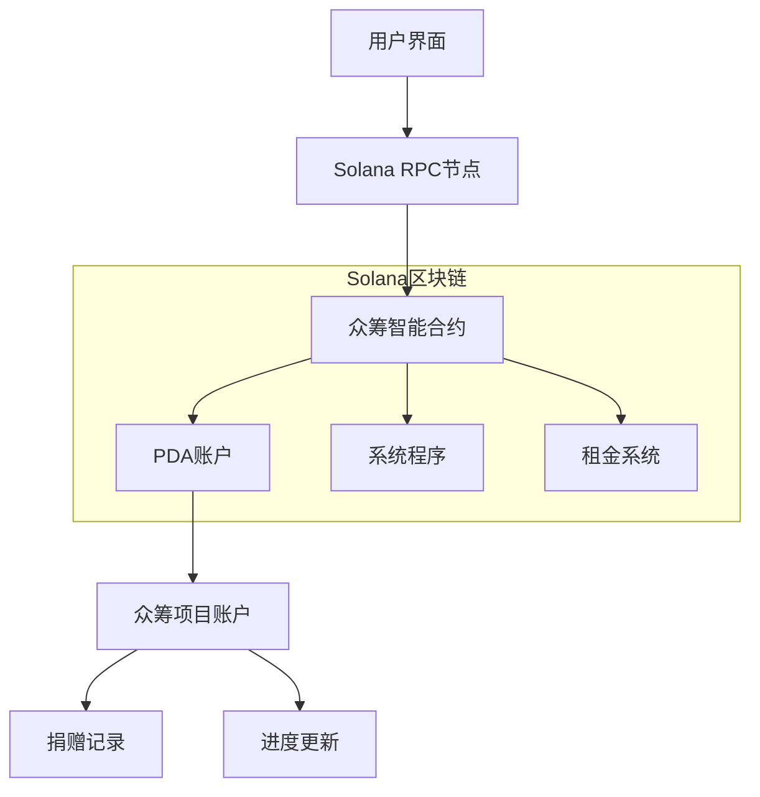

### 2.2 合约模块架构

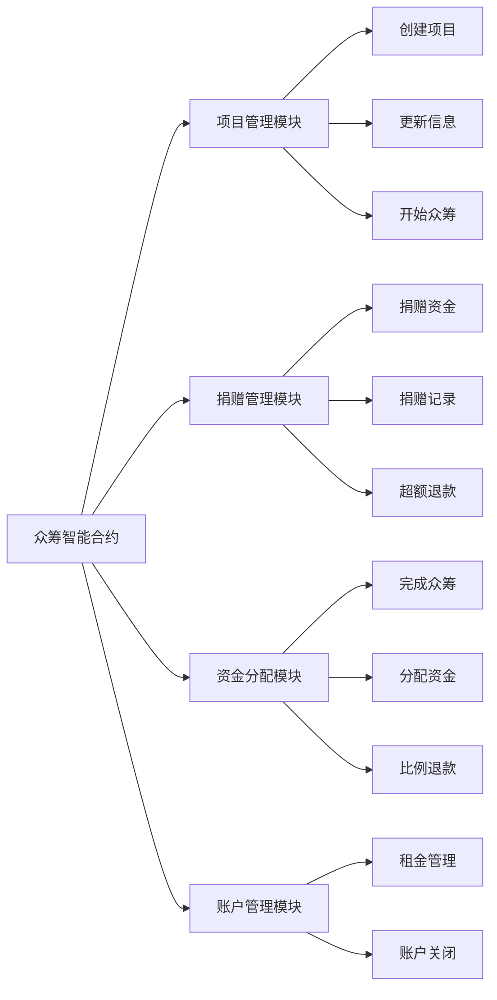

## 3. 数据模型设计

### 3.1 核心账户结构

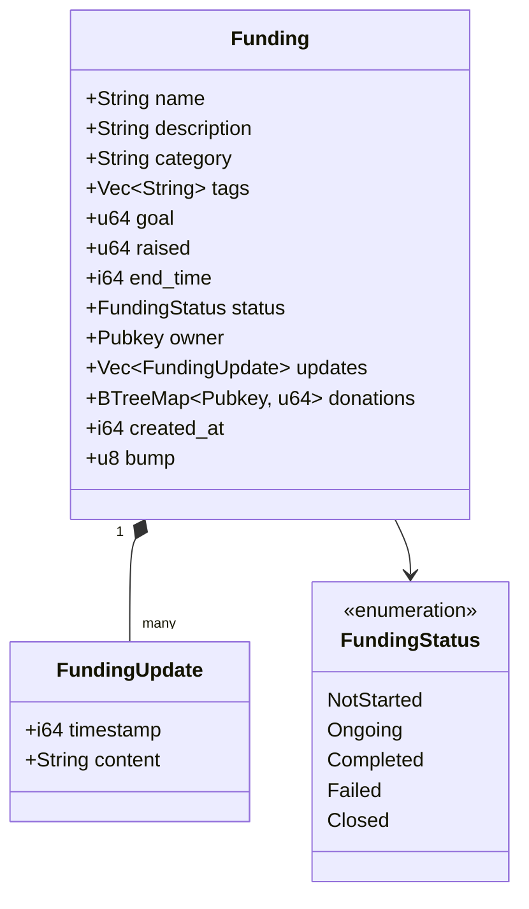

### 3.2 PDA账户派生

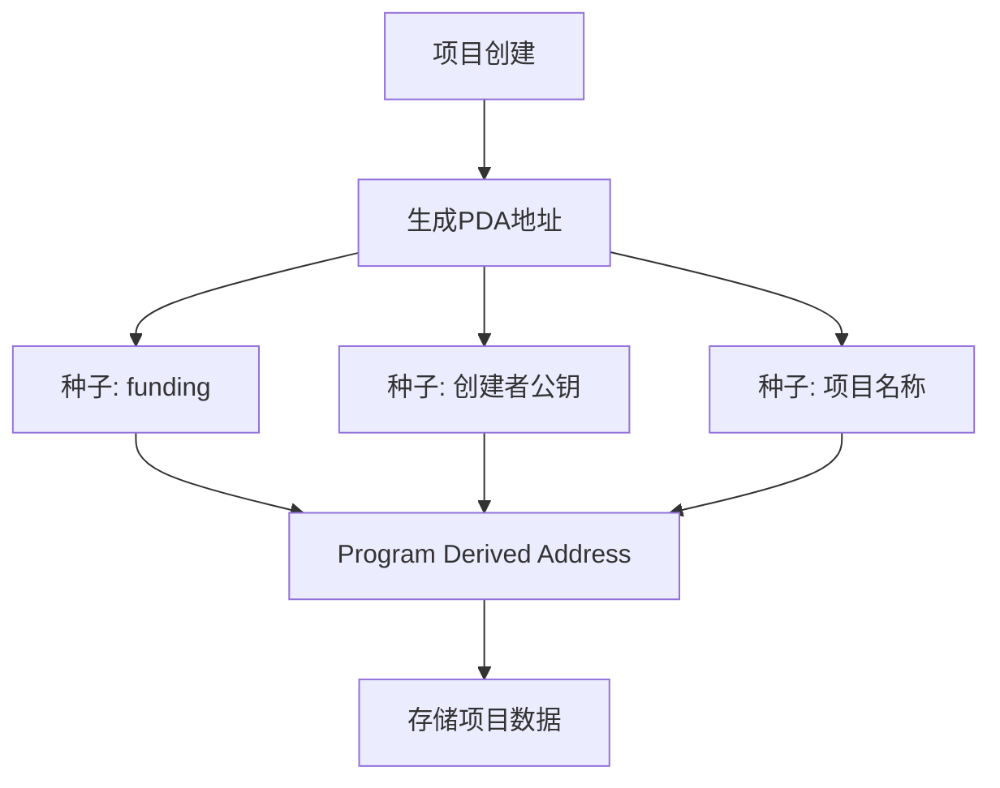

## 4. 核心业务流程

### 4.1 项目创建流程

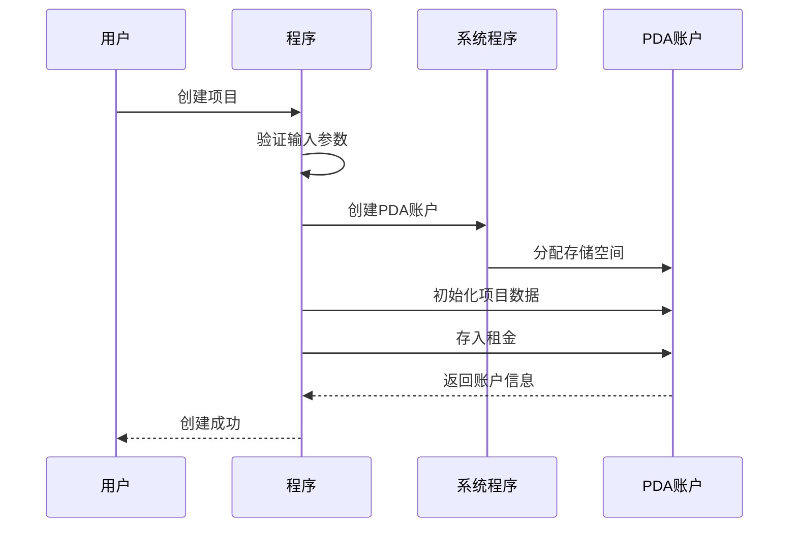

### 4.2 捐赠流程

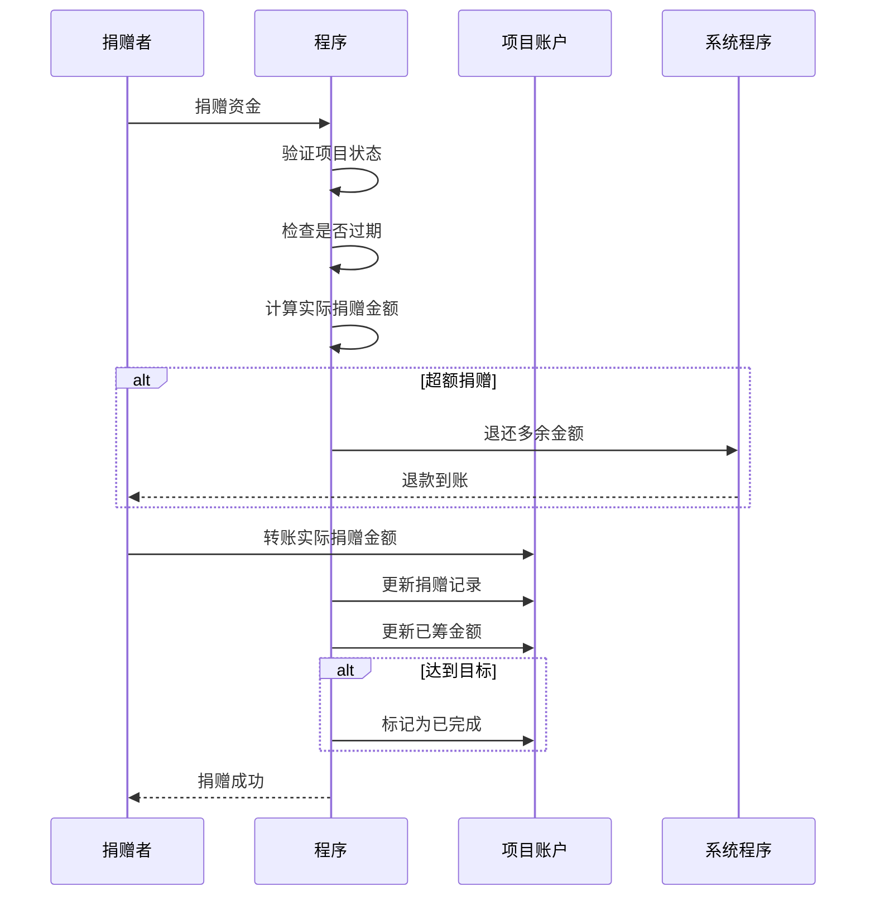

### 4.3 资金分配流程

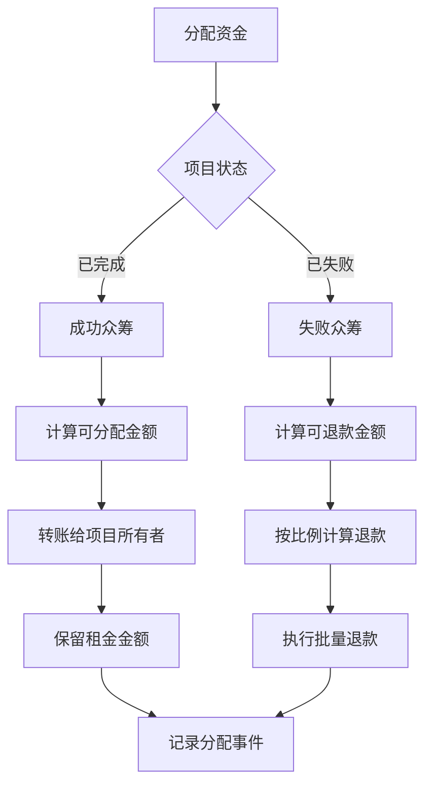

## 5. 状态转换机制

### 5.1 状态转换图

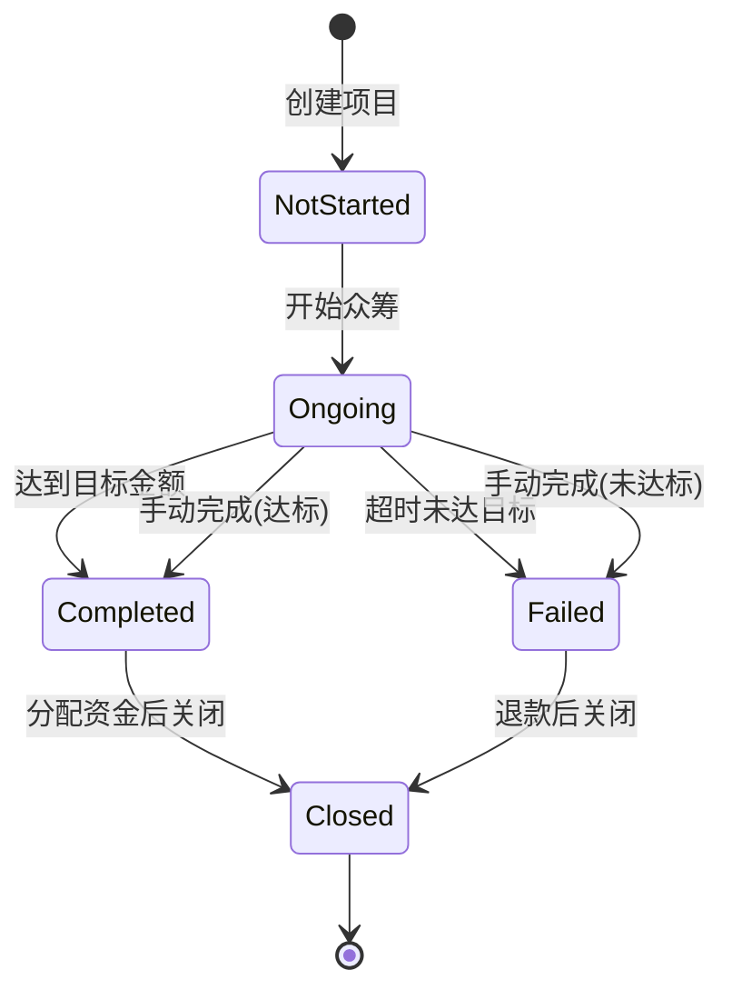

### 5.2 权限控制矩阵

| 操作 | 项目所有者 | 捐赠者 | 其他用户 |
|------|------------|--------|----------|
| 创建项目 | ✅ | ✅ | ✅ |
| 更新项目 | ✅ | ❌ | ❌ |
| 开始众筹 | ✅ | ❌ | ❌ |
| 捐赠资金 | ✅ | ✅ | ✅ |
| 添加更新 | ✅ | ❌ | ❌ |
| 完成众筹 | ✅ | ❌ | ❌ |
| 分配资金 | ✅ | ❌ | ❌ |
| 关闭账户 | ✅ | ❌ | ❌ |

## 6. 核心算法实现

### 6.1 超额捐赠处理算法

```
输入：捐赠金额amount，目标金额goal，已筹金额raised
输出：实际捐赠金额actual_donation，退款金额refund_amount

1. 计算剩余需要金额：remaining = goal - raised
2. 如果amount <= remaining：
   - actual_donation = amount
   - refund_amount = 0
3. 否则：
   - actual_donation = remaining
   - refund_amount = amount - remaining
4. 返回(actual_donation, refund_amount)
```

### 6.2 按比例退款算法

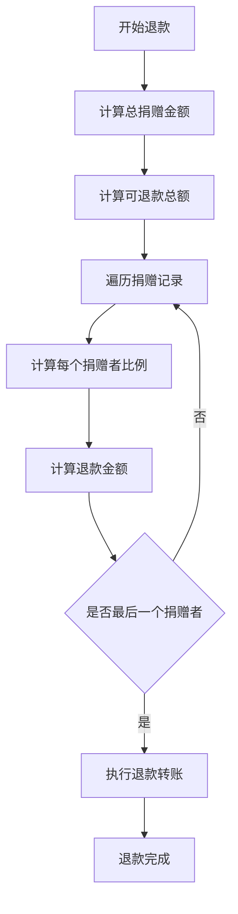

## 7. 错误处理机制

### 7.1 错误类型层次结构

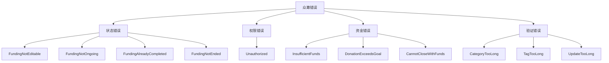

## 8. 租金管理策略

### 8.1 租金生命周期

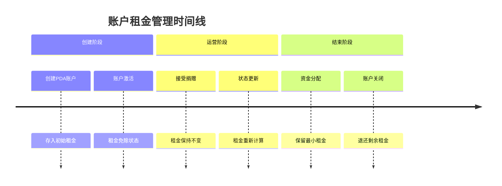

## 9. 部署和运维

### 9.1 部署架构

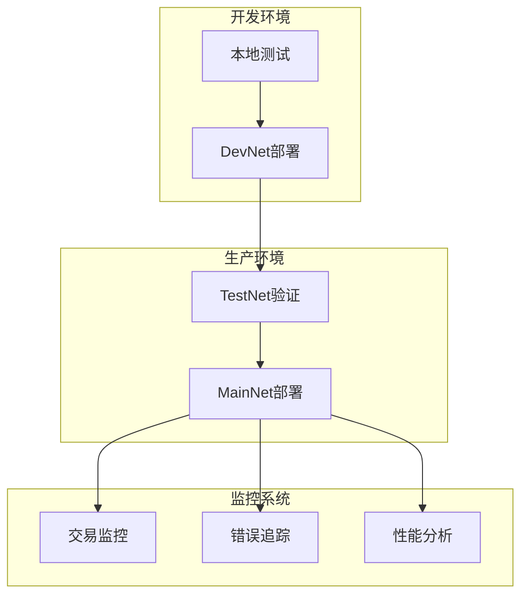

### 9.2 关键指标监控

| 指标 | 目标值 | 监控频率 |
|------|--------|----------|
| 活跃项目数量 | > 100 | 每小时 |
| 交易成功率 | > 99% | 实时 |
| 平均捐赠金额 | 动态调整 | 每天 |
| 项目成功率 | > 60% | 每周 |

## 10. 安全考虑

### 10.1 安全防护层次

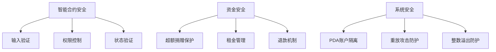

## 11. 性能优化

### 11.1 存储优化策略

- **BTreeMap捐赠记录**：O(log n)查询效率
- **动态数组更新**：预分配空间减少重新分配
- **PDA账户设计**：减少账户创建成本
- **租金优化**：最小化存储占用

## 12. 未来扩展

### 12.1 扩展路线图

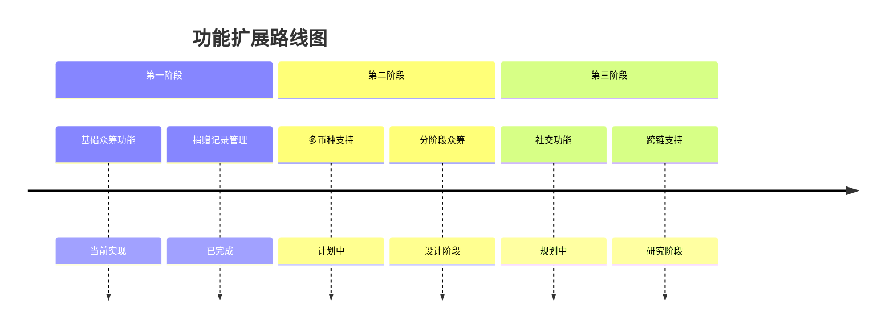

## 13. 结论

本设计方案提供了一个完整、安全、高效的Solana众筹平台解决方案。通过合理的架构设计、严格的状态管理和优化的资金处理机制，确保了平台的可靠性和用户体验。该实现充分考虑了Solana区块链的特性，包括PDA账户、租金管理和高性能交易处理，为去中心化众筹领域提供了可靠的底层基础设施。

### 关键优势：
1. **完全去中心化**：所有操作通过智能合约执行
2. **资金安全**：多重保护机制确保资金安全
3. **用户体验**：简化的操作流程和清晰的错误提示
4. **成本优化**：有效的租金管理降低用户成本
5. **可扩展性**：模块化设计支持未来功能扩展

该方案已通过全面测试，具备生产环境部署条件，将为区块链众筹应用提供坚实的技术基础。